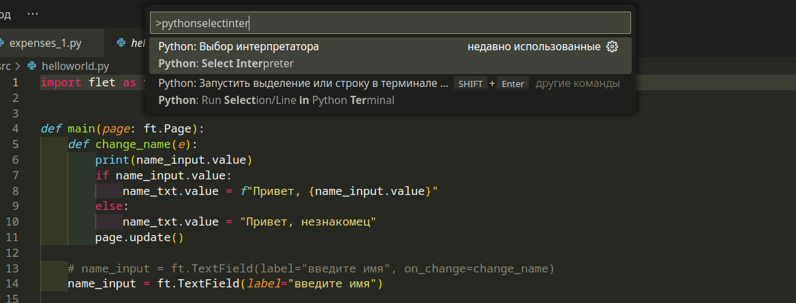
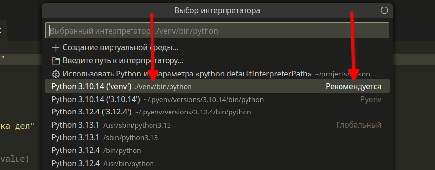

# Group531 app

## Папка с виртуальным окружением:

Обычно одна из двух папок:

- `venv`
- `.venv`

## Работа с виртуальным окружением(в течение всего проекта):

Эти команды(кроме первой) скорее всего нужно будет запускать в течение всего проекта(месяца)

`python -m venv venv` создание виртуального окружения

`source venv/bin/activate` активация виртуального окружения

`deactivate` деактивация виртуального окружения

## Создание проекта:

`mkdir month3hw` - создание директории(один раз)

`cd month3hw` - переход в директорию

`python -m venv venv` - создание виртуального окружения(один раз)[или `python -m venv .venv`]

`source venv/bin/activate` - активация виртуального окружения

`pip install flet` - установка библиотеки `flet`(ТОЛЬКО ПОСЛЕ АКТИВАЦИИ ВИРТУАЛЬНОГО ОКРУЖЕНИЯ!)

`flet create` - создание проекта(один раз)(ОБЯЗАТЕЛЬНО!)

`git init` - инициализация репозитория(один раз)

## Запуск проекта:

НЕ запускайте проек при помощи стрелочки, запускайте в терминале

`source venv/bin/activate` - активация виртуального окружения в терминале

В VSCode также нужно активировать виртуальное окружение. Жмете `Ctrl+Shift+P` , вбиваете `Python: Select Interpreter` и жмете, как на снимке:

далее выбираете `./venv/bin/python` или `./.venv/bin/python`:

`python src/main.py` - запуск проекта в терминале

## Элементы интерфейса:

- `flet.Text` - текст
- `flet.Column` - колонка, в которую можно добавлять другие элементы интерфейса, которые будут расположены вертикально
- `flet.Row` - ряд, в котором можно добавлять другие элементы интерфейса, которые будут расположены горизонтально
- `flet.TextField` - поле для ввода текста
- `flet.ElevatedButton` - приподнятая кнопка
- `flet.OutlinedButton` - кнопка с рамкой
- `flet.IconButton` - кнопка с иконкой

## Термины:

- desktop application: Приложение запущенное на рабочем столе
- page: страница, основная часть приложения
- controls: эдементы управления в приложении, общее название
- input: поле для ввода
- update: обновление страницы(приложения)
- value: значение элемента
- on_click: функция, которая будет вызываться при нажатии на кнопку
- event: событие(нажатие на кнопку, ввод текста и т.д.)
- horizontal_alignment: выравнивание по горизонтали
- vertical_alignment: выравнивание по вертикали
- column: колонка, в которую могут быть добавлены другие элементы
- row: строка, ряд, в который могут быть добавлены другие элементы
- data: данные
- date: дата(год месяц число)
